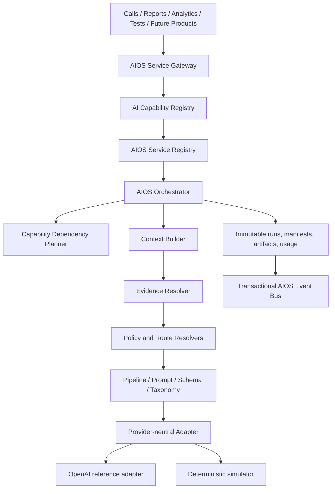

# AIOS Architecture Diagram

```mermaid
flowchart TD
  A["Calls / Reports / Analytics / Tests / Future Products"] --> G["AIOS Service Gateway"]
  G --> C["AI Capability Registry"]
  C --> S["AIOS Service Registry"]
  S --> O["AIOS Orchestrator"]
  O --> D["Capability Dependency Planner"]
  O --> X["Context Builder"]
  X --> E["Evidence Resolver"]
  E --> P["Policy and Route Resolvers"]
  P --> V["Pipeline / Prompt / Schema / Taxonomy"]
  V --> R["Provider-neutral Adapter"]
  R --> OA["OpenAI reference adapter"]
  R --> SIM["Deterministic simulator"]
  O --> DB["Immutable runs, manifests, artifacts, usage"]
  DB --> B["Transactional AIOS Event Bus"]
```
